# Prime Stack Defect Report

Course: Software Validation, Verification and Security Testing  
Application under test: Frost Inventory and Shopping System  
Team: Prime Stack  
Environment: Local backend `http://localhost:3000`, frontend `http://localhost:4200`  
Report date: 19 May 2026

## 1. Defect Origin Summary

Not every defect came from the same test type. DEF-001 and DEF-002 were confirmed by backend functional tests. DEF-005, DEF-006, and DEF-007 come from security test design/scripted security checks. DEF-008 comes from the ZAP scan/header verification. DEF-003 and DEF-004 are source-code review/API robustness defects. DEF-009 and DEF-010 were confirmed by expanded Playwright profile coverage. DEF-011 and DEF-012 come from teammate manual usability review.

| ID | Title | Origin | Severity | Status |
| --- | --- | --- | --- | --- |
| DEF-001 | Missing/invalid email returns 500 instead of 400 | Functional tests TC-FUNC-002, TC-FUNC-008 | Medium | Fixed |
| DEF-002 | Template literal bug in `getPurchaseByUserId` | Functional test TC-FUNC-032 | Medium | Fixed |
| DEF-003 | `SupplierRoute` POST has no error handling | Source-code review | Medium | Fixed |
| DEF-004 | Login route hardcodes status 500 | Functional/API error-handling review | Medium | Fixed |
| DEF-005 | Mass assignment allows any user to register as admin | Security test ST-005 | Critical | Fixed |
| DEF-006 | `/User/users` exposes all user data without authentication | Security test ST-007 and route review | High | Fixed |
| DEF-007 | XSS payload stored in database without sanitization | Security test ST-003 | Medium | Fixed |
| DEF-008 | Missing security headers | ZAP scan/header verification | Low | Fixed |
| DEF-009 | Login stores value objects in session, causing `[object Object]` in UI | Playwright profile test UT-007 | Medium | Fixed |
| DEF-010 | Profile refresh assigns wrapped API response as user state | Playwright profile edit test UT-009 | Medium | Fixed |
| DEF-011 | Inconsistent background color on registration input fields | Manual usability test UT-MAN-001 | Low | Open |
| DEF-012 | Missing search and filtering functionality for product discovery | Manual usability test UT-MAN-002 | Medium | Open |

## 2. Functional Test Evidence Summary

Before the fixes, the functional suite result was:

```text
Test Suites: 2 failed, 2 passed, 4 total
Tests: 3 failed, 33 passed, 36 total
```

After fixing the functional and API defects, the functional suite result was:

```text
Test Suites: 4 passed, 4 total
Tests: 36 passed, 36 total
```

After fixing the security defects, the k6 security result was:

```text
checks_succeeded: 100.00% 8 out of 8
checks_failed: 0.00% 0 out of 8
```

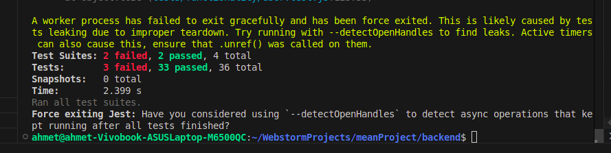

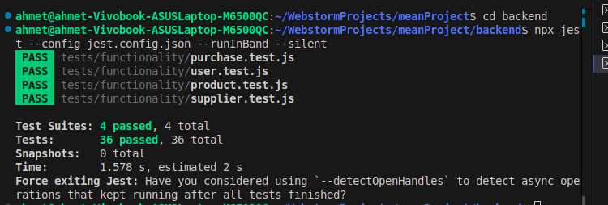

## DEF-001: Missing/Invalid Email Returns 500 Instead of 400

### Origin

Functional testing. Confirmed by:

- `TC-FUNC-002: should reject registration with missing email`
- `TC-FUNC-008: should reject invalid email format`

### Details

| Field | Value |
| --- | --- |
| Severity | Medium |
| Status | Fixed |
| Test file | `backend/tests/functionality/user.test.js` |
| Source files | `backend/domain/user/valueObjects/Email.js`, `backend/api/UserRoute.js` |

Before the fix, `Email.js` threw plain `Error` objects. `UserRoute.js` checks `error.statusCode`; plain errors do not have that property, so the route fell back to `500`.

Before:

```js
throw new Error("Email required");
throw new Error("Invalid email format");
```

After:

```js
throw new ValidationError("Email required");
throw new ValidationError("Invalid email format");
```

The route behavior then correctly maps the validation failure to `400 Bad Request`.

### Evidence

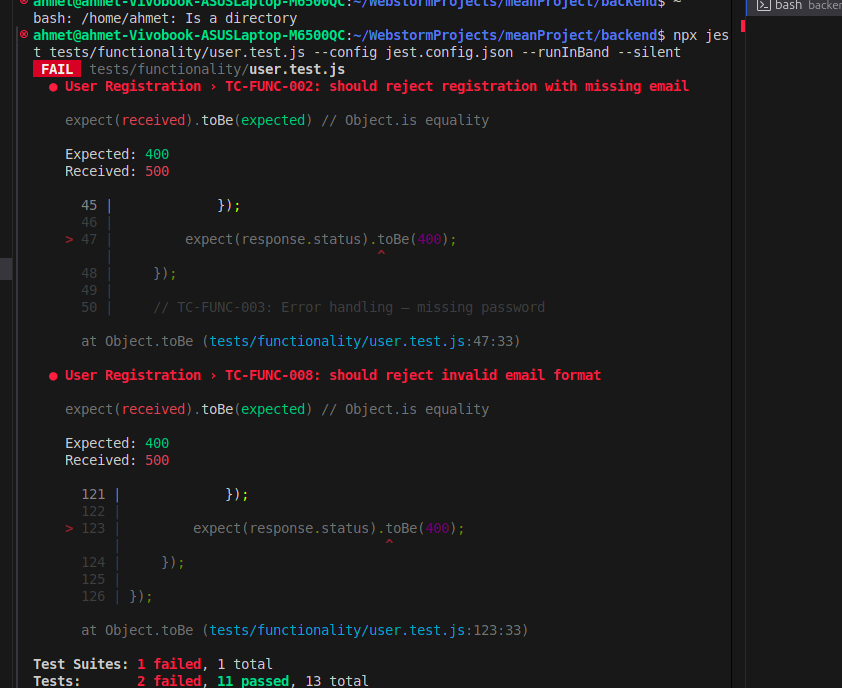

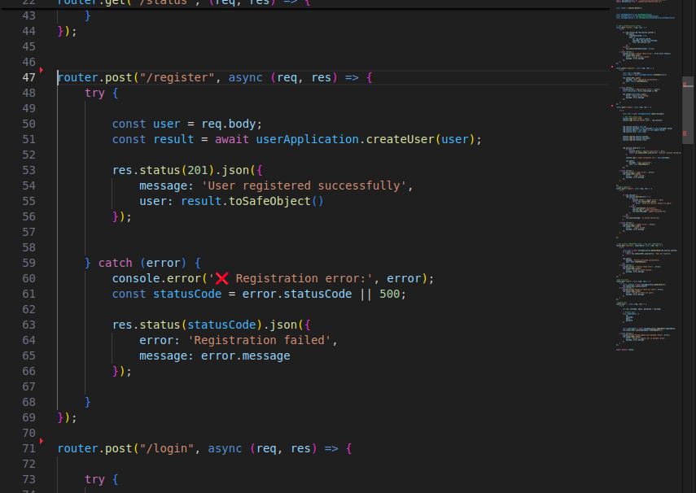

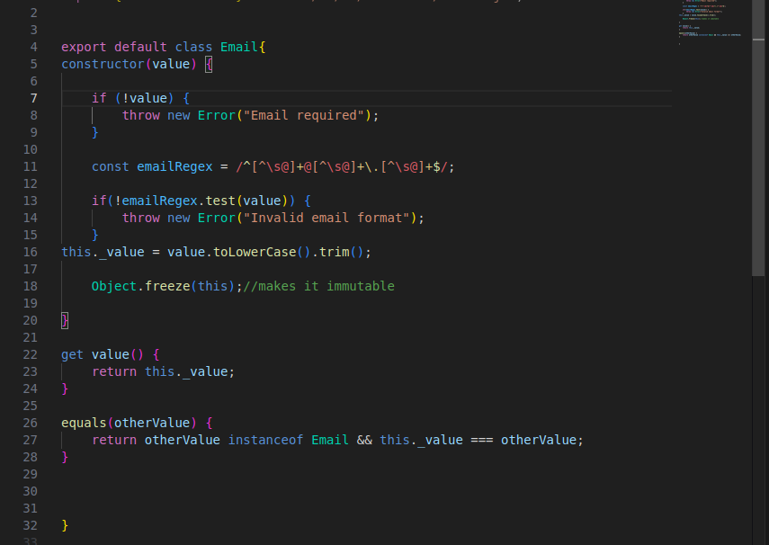

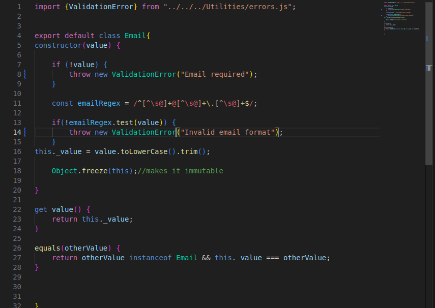

## DEF-002: Template Literal Bug in `getPurchaseByUserId`

### Origin

Functional testing. Confirmed by:

- `TC-FUNC-032: should return purchases for a valid user id`

### Details

| Field | Value |
| --- | --- |
| Severity | Medium |
| Status | Fixed |
| Test file | `backend/tests/functionality/purchase.test.js` |
| Source file | `backend/domain/purchase/PurchaseRepository.js` |

Before the fix, the SQL string used normal quotes, so `${orderClause}` was sent to MySQL literally.

Before:

```js
const sql = 'SELECT * FROM purchase WHERE userId = ? ${orderClause}';
```

After:

```js
const sql = `SELECT * FROM purchase WHERE userId = ? ${orderClause}`;
```

This allows `ORDER BY date ASC` or `ORDER BY date DESC` to be inserted into the SQL query correctly.

### Evidence

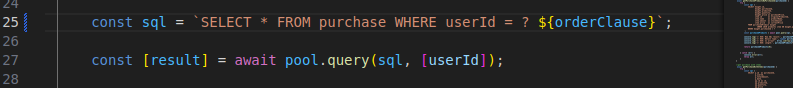

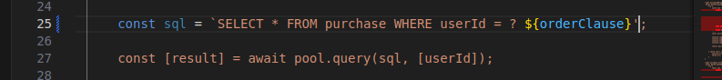

## DEF-003: `SupplierRoute` POST Has No Error Handling

### Origin

Source-code review.

### Details

`POST /Supplier/` directly awaits supplier creation without local `try/catch` handling. If validation or duplicate checks fail, the API may return an uncontrolled server error instead of a structured `400` or `409` response.

Fix applied: supplier creation is now wrapped in `try/catch`. The route uses `error.statusCode || 500`, returns a structured JSON error body, and still preserves the previous success behavior.

## DEF-004: Login Route Hardcodes Status 500

### Origin

Functional/API error-handling review.

### Details

The login route returns `500` for invalid login cases. Wrong password, unknown username, and missing credentials should be client/authentication failures.

Expected statuses:

- Missing username/password: `400 Bad Request`
- Wrong username/password: `401 Unauthorized`
- Unexpected backend failure: `500 Internal Server Error`

Fix applied: the login route now uses `error.statusCode || 500`, the same pattern used by the registration route.

Verification:

- Wrong username/password returns `401 Unauthorized`.
- Missing credentials returns `400 Bad Request`.
- Functional suite passed with `36/36` tests.

### Evidence

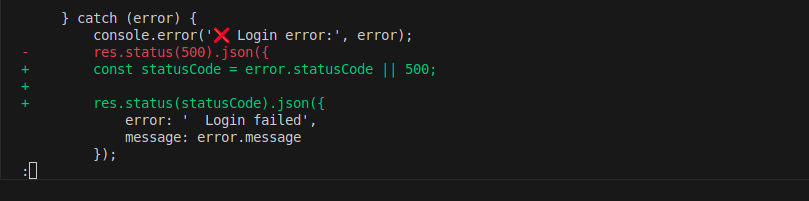

## DEF-005: Mass Assignment Allows Any User to Register as Admin

### Origin

Security test ST-005.

### Details

The security test attempts to register with `role: "admin"` in the request body. Public registration should not accept privileged fields from the client.

Fix applied: public registration no longer trusts `userData.role`. `UserFactory.createUser()` always creates normal users with role `user`; privileged admin creation must happen through the separate `createAdmin()` path.

Verification from k6:

```text
ST-005 Mass Assignment: 201 ... "role":"user"
✓ ST-005 mass assignment does not grant admin role
```

### Evidence

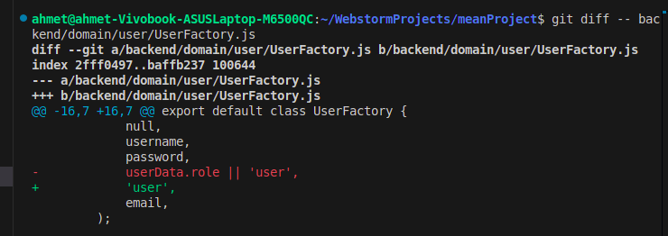

## DEF-006: `/User/users` Exposes All User Data Without Authentication

### Origin

Security test ST-007 and route review.

### Details

`GET /User/users` should require authentication and admin authorization. Public access can expose user data and support account enumeration.

Expected behavior:

- Unauthenticated request: `401 Unauthorized`
- Authenticated non-admin request: `403 Forbidden`
- Admin request: safe user list only

Fix applied: `/User/users` now uses `requireAdmin`, which returns `401` for unauthenticated users and `403` for users without sufficient privileges.

Verification from k6:

```text
ST-007 Unauth User List: 401 - {"error":"Authentication required"}
✓ ST-007 user list requires authentication
```

### Evidence

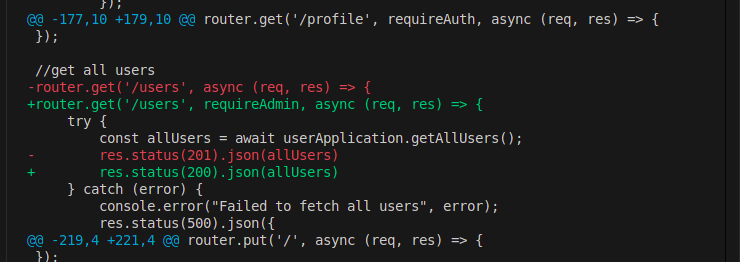

## DEF-007: XSS Payload Stored in Database Without Sanitization

### Origin

Security test ST-003.

### Details

The security test sends `<script>alert("xss")</script>` as a username. The application should reject or sanitize this input before storage/display.

Fix applied: the `Username` value object now rejects `<` and `>` characters, preventing script-tag usernames from being stored.

Verification from k6:

```text
ST-003 XSS Registration: 400 - {"error":"Registration failed","message":"Username contains invalid characters"}
✓ ST-003 XSS payload in username is handled
```

### Evidence

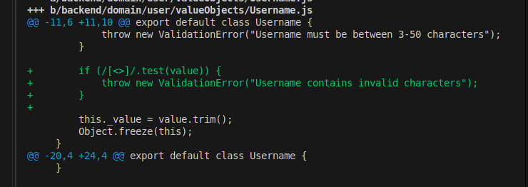

## DEF-008: Missing Security Headers

### Origin

ZAP scan.

### Details

ZAP reported missing or weak security headers:

| Header issue | Risk | Evidence |
| --- | --- | --- |
| CSP missing no-fallback directives | Medium | `Content-Security-Policy: default-src 'none'` without `frame-ancestors` and `form-action` |
| `X-Content-Type-Options` missing | Low | `/Product/` response does not include `nosniff` |
| `X-Powered-By` exposed | Low | Response contains `X-Powered-By: Express` |

Fix applied:

- `app.disable('x-powered-by')`
- `X-Content-Type-Options: nosniff`
- `Content-Security-Policy: default-src 'self'; frame-ancestors 'none'; form-action 'self'`
- Custom JSON `404` handler so missing routes such as `/robots.txt` no longer fall back to Express's default CSP.

Verification from header check:

```text
HTTP/1.1 404 Not Found
X-Content-Type-Options: nosniff
Content-Security-Policy: default-src 'self'; frame-ancestors 'none'; form-action 'self'
```

### Evidence

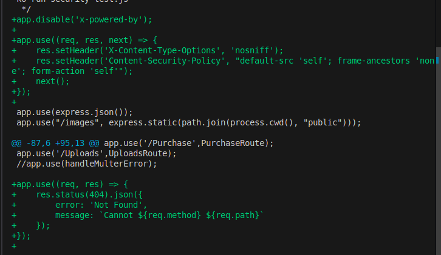

## DEF-009: Login Stores Value Objects in Session, Causing `[object Object]` in UI

### Origin

Frontend Playwright profile testing. Confirmed by:

- `UT-007: Client can view profile and open edit profile form`

### Details

| Field | Value |
| --- | --- |
| Severity | Medium |
| Status | Fixed |
| Test file | `frontend/tests/example.spec.ts` |
| Source file | `backend/api/UserRoute.js` |

The login route stored `user.username` and `user.email` directly in the session. In some cases those fields are value objects, so `/User/status` returned an object instead of a string. The Angular profile screen then rendered `Welcome, [object Object]!`.

Fix applied: the login route now stores primitive string values using `.value` or `._value` before falling back to the raw field.

Verification:

```text
PASS [chromium] UT-007: Client can view profile and open edit profile form
PASS [firefox] UT-007: Client can view profile and open edit profile form
```

## DEF-010: Profile Refresh Assigns Wrapped API Response as User State

### Origin

Frontend Playwright profile edit testing. Confirmed by:

- `UT-009: Client can edit profile username and email`

### Details

| Field | Value |
| --- | --- |
| Severity | Medium |
| Status | Fixed |
| Test file | `frontend/tests/example.spec.ts` |
| Source file | `frontend/src/app/components/clientPanels/client-profile/client-profile.ts` |

After a profile update, the profile component refreshed the user profile but assigned the full API response wrapper to `currentUser`. Because `/User/profile` returns `{ message, user }`, the page could render blank profile fields after saving.

Fix applied: `fetchFreshProfile()` now assigns `response.user || response`, so both wrapped and direct user responses are handled.

Verification:

```text
PASS [chromium] UT-009: Client can edit profile username and email
PASS [firefox] UT-009: Client can edit profile username and email
```

## DEF-011: Inconsistent Background Color on Registration Input Fields

### Origin

Manual usability testing from teammate review. Related observation:

- `UT-MAN-001: Registration visual consistency`

### Details

| Field | Value |
| --- | --- |
| Severity | Low |
| Priority | Medium |
| Status | Open |
| Source | Manual usability test |
| Area | Frontend `/login` registration form |

On the registration form, the username and password inputs appear with a gray background while the email input appears white. Test users may interpret the gray fields as disabled or less editable, which slows down the registration flow.

Steps to reproduce:

1. Navigate to `http://localhost:4200/login`.
2. Click the `Register` tab.
3. Compare the username, email, and password input field backgrounds.

Expected result: all active registration inputs use consistent visual styling.

Actual result: input field background colors are inconsistent.

Suggested fix: unify CSS styling for all input fields in the login/register component.

### Evidence

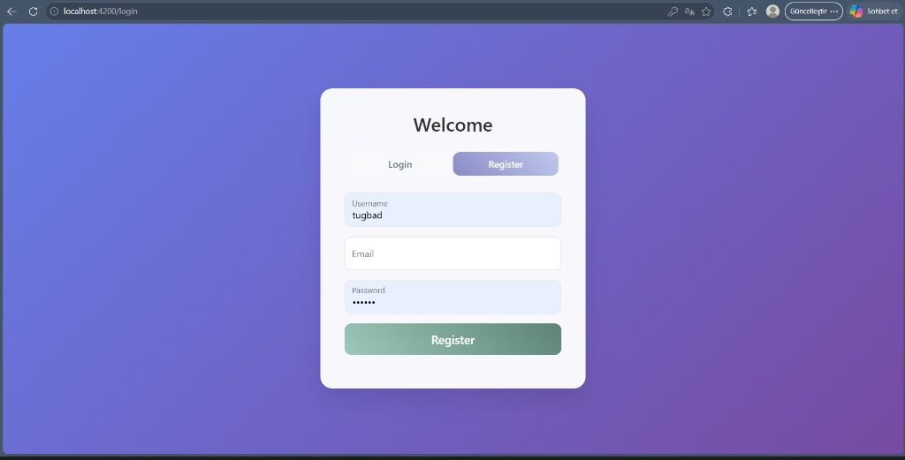

## DEF-012: Missing Search and Filtering Functionality for Product Discovery

### Origin

Manual usability testing from teammate review. Related observation:

- `UT-MAN-002: Product discovery/search`

### Details

| Field | Value |
| --- | --- |
| Severity | Medium |
| Priority | High |
| Status | Open |
| Source | Manual usability test |
| Area | Frontend client dashboard / product discovery |

The client dashboard and product discovery workflow do not provide search or category filtering. As inventory grows, users may need to scan manually through product cards, increasing task time.

Steps to reproduce:

1. Log in as a client user.
2. Navigate to the client dashboard and product browsing workflow.
3. Attempt to search for a specific product name or filter by category/supplier.

Expected result: a search bar and basic filtering controls are available.

Actual result: no search or filtering functionality is available in the observed dashboard/product discovery flow.

Suggested fix: add product search and filter controls to the client-facing product discovery workflow.

### Evidence

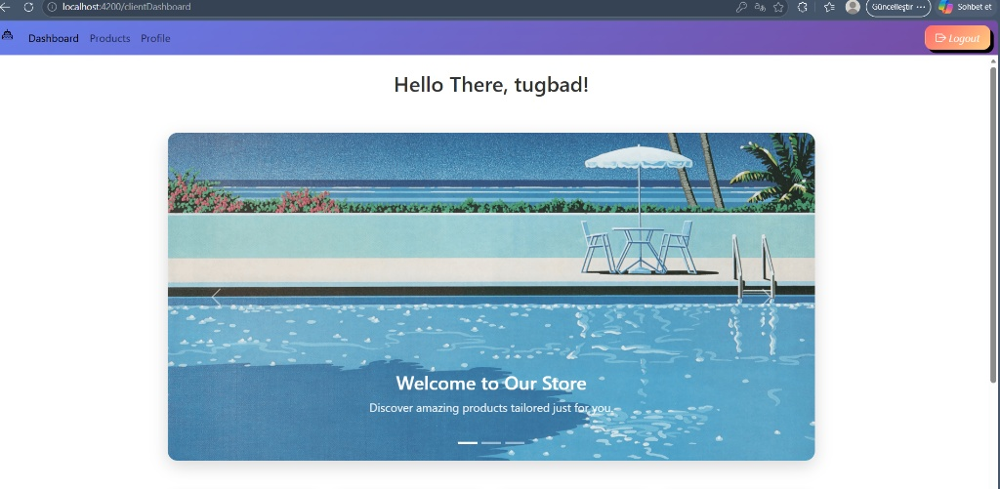
