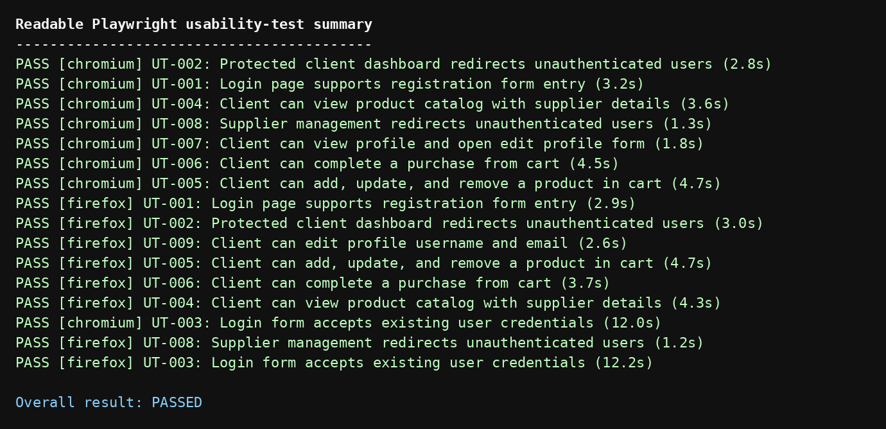
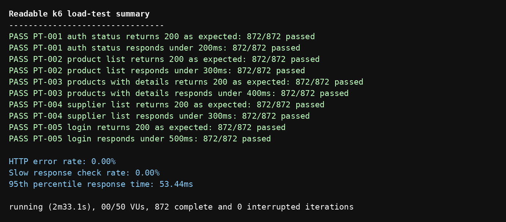
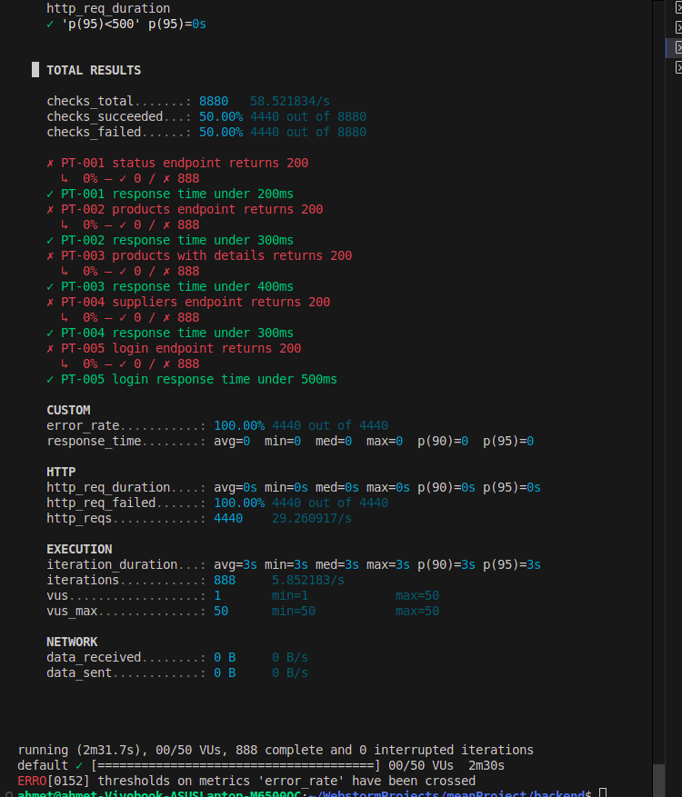
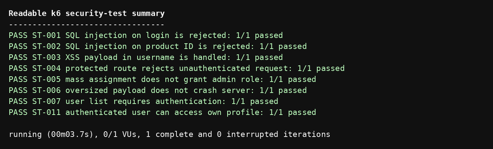
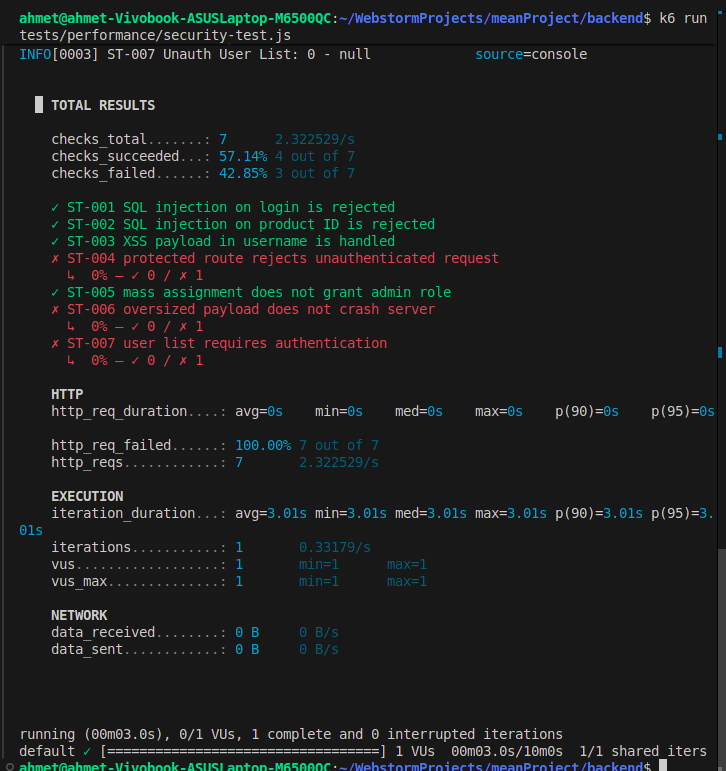

# Prime Stack Test Execution Report

Team: Prime Stack  
Application under test: Frost Inventory and Shopping System  
Report date: 19 May 2026

## 1. Execution Summary

Testing was performed for the Frost Inventory and Shopping System in the local development environment. The testing effort included automated backend functional tests, Playwright UI/usability scenarios, k6 performance and security scripts, and an OWASP ZAP automated scan of the backend API.

The final defect list contains ten fixed defects and two open manual usability findings. DEF-001 through DEF-012 are now the canonical IDs used across all reports.

## 2. Test Environment

| Item | Value |
| --- | --- |
| Backend | Express API on `http://localhost:3000` |
| Frontend | Angular app on `http://localhost:4200` |
| Database | MySQL database `frost` |
| Functional tools | Jest, Supertest |
| Frontend/usability tool | Playwright |
| Performance/security script tool | k6 |
| Security scanner | ZAP by Checkmarx 2.17.0 |

## 3. Execution Results by Test Type

| Test type | Planned | Evidence | Result summary |
| --- | ---: | --- | --- |
| Functional API tests | 36 | `backend/tests/functionality` | Final run passed: 4 suites, 36 tests |
| Frontend usability checks | 9 automated scenarios / 18 browser executions plus manual review | `frontend/tests/example.spec.ts` and teammate DOCX review | Final Playwright run passed in Chromium and Firefox: 18/18 executions; two open manual usability findings recorded |
| Performance tests | 6 | `backend/tests/performance/load-test.js` | Final k6 load run passed: HTTP error rate 0.00%, p95 53.38 ms |
| Security scripted tests | 8 scripted checks | `backend/tests/performance/security-test.js` | Final k6 security run passed: 8/8 checks |
| ZAP scan | 1 scan | `docs/testing/evidence/2026-05-14-ZAP-Secuirty-Report-.html` | Header findings recorded under DEF-008 |

## 4. Functional Test Execution

Before the fixes, the functional suite showed 3 failing tests. The failures were connected to missing/invalid email handling and purchase SQL interpolation.

After applying fixes, the final functional result was:

```text
Test Suites: 4 passed, 4 total
Tests: 36 passed, 36 total
```


## 5. Frontend Usability Test Execution

Frontend usability tests are written with Playwright. They cover:

- UT-001: Registration form entry.
- UT-002: Protected client dashboard redirects unauthenticated users.
- UT-003: Existing user login form submission.
- UT-004: Product catalog with supplier details.
- UT-005: Cart add, quantity update, and remove workflow.
- UT-006: Purchase from cart.
- UT-007: Profile view and edit modal opening.
- UT-008: Supplier management route protection.
- UT-009: Client profile username/email edit.

Final Playwright result:

```text
18 browser executions passed across Chromium and Firefox.
Overall result: PASSED
```

The expanded Playwright coverage exposed and verified fixes for profile/session display issues recorded as DEF-009 and DEF-010.



Additional teammate manual usability review notes:

| Metric / observation | Result | Notes |
| --- | --- | --- |
| Think-aloud session | Conducted with 3 real users | Local development environment |
| Average completion time for registration flow | 42 seconds | Registration was functional, but visual inconsistency slowed users down |
| Average completion time for product discovery | 115 seconds | Product discovery took longer because search/filtering is missing |
| Average satisfaction score | 3.8 / 5.0 | Users found the dashboard clean but lacking essential e-commerce tools |

## 6. Performance Test Execution

The k6 load test uses this load profile:

| Stage | Duration | Target virtual users |
| --- | ---: | ---: |
| Normal load | 30 seconds | 5 |
| Load ramp | 1 minute | 20 |
| Stress | 30 seconds | 50 |
| Recovery | 30 seconds | 0 |

Performance acceptance thresholds:

- 95% of requests should complete in under 500 ms.
- Error rate should stay below 10%.

The final k6 load result was valid because the backend returned real HTTP responses throughout the run:

```text
PASS PT-001 auth status returns 200 as expected: 872/872 passed
PASS PT-002 product list returns 200 as expected: 872/872 passed
PASS PT-003 products with details returns 200 as expected: 872/872 passed
PASS PT-004 supplier list returns 200 as expected: 872/872 passed
PASS PT-005 login returns 200 as expected: 872/872 passed
HTTP error rate: 0.00%
Slow response check rate: 0.00%
95th percentile response time: 53.38ms
```



An earlier invalid k6 load result is retained as evidence of an environment mistake. It showed `status 0`, `http_req_failed 100%`, and `data_received 0 B`, which means k6 did not receive HTTP responses from the backend.



## 7. Security Test Execution

The scripted security test covers:

- SQL injection on login.
- SQL injection in product ID parameter.
- XSS payload in registration username.
- Unauthenticated profile access.
- Mass assignment using `role: "admin"`.
- Oversized login payload.
- Unauthenticated access to `/User/users`.
- Authenticated access to `/User/profile` after login.

The final k6 security run passed all scripted checks:

```text
PASS ST-001 SQL injection on login is rejected: 1/1 passed
PASS ST-002 SQL injection on product ID is rejected: 1/1 passed
PASS ST-003 XSS payload in username is handled: 1/1 passed
PASS ST-004 protected route rejects unauthenticated request: 1/1 passed
PASS ST-005 mass assignment does not grant admin role: 1/1 passed
PASS ST-006 oversized payload does not crash server: 1/1 passed
PASS ST-007 user list requires authentication: 1/1 passed
PASS ST-011 authenticated user can access own profile: 1/1 passed
```



One earlier uploaded k6 security run also shows `status 0` and `data_received 0 B`. That specific run is invalid for pass/fail grading because k6 could not reach the backend. The security defects themselves were still confirmed by route review and earlier scripted checks, then fixed in code.



## 8. ZAP Scan Results

ZAP report details:

| Attribute | Value |
| --- | --- |
| Tool | ZAP by Checkmarx |
| Version | 2.17.0 |
| Generated | Thu 14 May 2026, 14:16:40 |
| Site | `http://localhost:3000` |
| Evidence file | `docs/testing/evidence/2026-05-14-ZAP-Secuirty-Report-.html` |

ZAP alert summary:

| Alert | Risk | Confidence | Evidence |
| --- | --- | --- | --- |
| CSP failure to define directive with no fallback | Medium | High | `default-src 'none'` without `frame-ancestors` and `form-action` |
| Server leaks `X-Powered-By` | Low | Medium | `X-Powered-By: Express` |
| `X-Content-Type-Options` header missing | Low | Medium | `/Product/` did not include `nosniff` |
| User Agent Fuzzer | Informational | Medium | Response changed for an old IE user agent |

## 9. Confirmed Defects

| ID | Title | Severity | Status |
| --- | --- | --- | --- |
| DEF-001 | Missing/invalid email returns 500 instead of 400 | Medium | Fixed |
| DEF-002 | Template literal bug in `getPurchaseByUserId` | Medium | Fixed |
| DEF-003 | `SupplierRoute` POST has no error handling | Medium | Fixed |
| DEF-004 | Login route hardcodes status 500 | Medium | Fixed |
| DEF-005 | Mass assignment allows any user to register as admin | Critical | Fixed |
| DEF-006 | `/User/users` exposes all user data without authentication | High | Fixed |
| DEF-007 | XSS payload stored in database without sanitization | Medium | Fixed |
| DEF-008 | Missing security headers | Low | Fixed |
| DEF-009 | Login stores value objects in session, causing `[object Object]` in UI | Medium | Fixed |
| DEF-010 | Profile refresh assigns wrapped API response as user state | Medium | Fixed |
| DEF-011 | Inconsistent background color on registration input fields | Low | Open |
| DEF-012 | Missing search and filtering functionality for product discovery | Medium | Open |

## 10. Overall Assessment

The application now has stronger automated coverage for core API behavior, UI workflows, cart/purchase/profile behavior, and session security. The latest backend load test, k6 security script, and Playwright usability suite all passed with the backend and frontend running locally.

## 11. Evidence List

| Evidence | File |
| --- | --- |
| ZAP full report | `docs/testing/evidence/2026-05-14-ZAP-Secuirty-Report-.html` |
| DEF-001 before/after evidence | `docs/testing/evidence/defects/def-001-*.png` |
| DEF-002 before/after evidence | `docs/testing/evidence/defects/def-002-*.png` |
| DEF-004 login status fix | `docs/testing/evidence/defects/def-004-login-statuscode-fix.png` |
| DEF-005 mass-assignment fix | `docs/testing/evidence/defects/def-005-mass-assignment-fix.png` |
| DEF-006 user-list auth fix | `docs/testing/evidence/defects/def-006-user-list-auth-fix.png` |
| DEF-007 XSS validation fix | `docs/testing/evidence/defects/def-007-xss-username-validation-fix.png` |
| DEF-008 security headers fix | `docs/testing/evidence/defects/def-008-security-headers-fix.png` |
| Functional pass screenshot | `docs/testing/evidence/defects/functional-after-36-passed.png` |
| Playwright product catalog screenshot | `frontend/tests/screenshots/UT-004-product-catalog.png` |
| Playwright cart workflow screenshot | `frontend/tests/screenshots/UT-005-cart-workflow.png` |
| Playwright purchase completion screenshot | `frontend/tests/screenshots/UT-006-purchase-complete.png` |
| Playwright profile screenshot | `frontend/tests/screenshots/UT-007-profile.png` |
| Playwright supplier route protection screenshot | `frontend/tests/screenshots/UT-008-supplier-protected.png` |
| Playwright profile edit screenshot | `frontend/tests/screenshots/UT-009-profile-edit.png` |
| Playwright final passing summary | `docs/testing/evidence/test-output/playwright-summary.png` |
| k6 load final passing summary | `docs/testing/evidence/test-output/k6-load-summary.png` |
| k6 security final passing summary | `docs/testing/evidence/test-output/k6-security-summary.png` |
| DEF-011 registration field color evidence | `docs/testing/evidence/friend-doc/def-011-registration-input-colors.png` |
| DEF-012 missing search/filter evidence | `docs/testing/evidence/friend-doc/def-012-dashboard-no-search.png` |
| Invalid k6 load run | `docs/testing/evidence/defects/performance-unreachable-run.png` |
| Invalid k6 security run | `docs/testing/evidence/defects/security-unreachable-run.png` |
